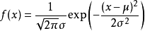

## 算法描述  
朴素贝叶斯算法是监督学习中分类算法中的一种。需要先通过学习一批分类**正确**的训练数据集得出模型才能进行分类,算法大致如下：

假设待分类的数据为X，类别集合为Y={Y1...Yn},分类算法其实是要确定一个规则Y=f(X)将X映射到Y中的一个元素上，而朴素贝叶斯的f(x)是通过使用贝叶斯公式分别计算X分类为Y1...Yn的概率，取概率最大分类 `f(x) = Max(P(Y1|X),P(Y2|X)...P(Yn|X))`。


朴素贝叶斯算法的学习的过程其实就是得出贝叶斯公式中各个概率常量的过程。 

贝叶斯公式：  
```   
    P(Y|X) = P(X|Y)P(Y)/P(X) 
    
```  

通过训练数据可以很容易得到P(X|Y)、P(Y)、P(X)，然后将待分类样本代入其中，计算出P(Y|X)最最大值。

>>**可以看出训练集的选择对最终结果的影响非常非常大**

最简单的情况下X只是一个事件，但实际情况中分类结果是受N多特征的共同影响下形成的，也就是说上述公式中的X不是单一事件，而是一系列事件
即X=[F1...Fn]上面的公式一应该写成:

   ``` 
   P(Y|F1..Fn) = P(F1...Fn|Y)P(Y)/P(F1...Fn)
   
   ```  

这些特征中也可能存在之间有一定影响关系的特征，但在朴素贝叶斯算法中有一个关键假设是**各特征相互独立**  。  
相互独立事件有：`P(AB)=P(A|B)P(B)=P(B|A)P(A)` 由于F1...Fn相互独立，所以可写成：

```
P(Y|F1..Fn) =
P(F1|Y)P(F2|Y)..P(Fn|Y)P(Y)/P(F1)P(F2)...P(Fn)

```

分别得出Y中的每个元素的概率P(Yi|F1..Fn),...,P(Y2|F1..Fn)比较大小，得出最后结果,因为是比较大小，所以分母可以省略，所以上面公式可以简单化成计算

```
   P(Y|F1..Fn) = P(F1|Y)P(F2|Y)..P(Fn|Y)P(Y)

```

最后得出预测结果:
```

f(x) = Max(P(Y1|F1..Fn),...,P(Y2|F1..Fn))

```

另外可以通过等式两边取对数，将乘法转换成加法比较大小:
```
 Log(P(Y|F1..Fn)) = Log(P(F1|Y)P(F2|Y)..P(Fn|Y)P(Y))
                  = Log(P(F1|Y)) + ...+ Log(P(Fn|Y)) +　Log(P(Y))
```


以上大致就是朴素贝叶斯算法的原理与过程，但还有两个问题，当特征值是连续值时概率如何计算;当特特征值在训练数据中没有出现时如计算？

对于连续值的问题有以下两种方式处理：
1. 将连续值进行离散化处理。
2. 用概率密度函数（高斯分布)，也就是说认为特征值呈正态分布。




用概率密度函数来计算每一种分类的概率大小，取最大值。

```
Y=P(F1)*P(F2)..P(Fn)
```
两边取对数，转换成加法，比如scikit-learn中*naive_bayes.py/GaussianNB*中就是这样实现的
>>在方差后面加`1e-9`避免除0 ?


### 代码实现
实现比较简单，统计一下各个概率值，代入公式即可。  
见：https://github.com/longforfreedom/ml/blob/master/naivebayes.py  

### scikit-learn
自己实现不复杂，用现成的更简单[scikit-learn中的朴素贝叶斯](http://scikit-learn.org/dev/modules/naive_bayes.html)中用于处理连续值的高斯分布型模型(Gaussian)、常用于处理分本分类的常用于多项式模型(Multinomial)以及伯努力模型(BernoulliNB)都有实现，

可以参考:http://www.cnblogs.com/pinard/p/6074222.html

TODO: **多项式模型(Multinomial)**


## 应用场景
1. 文本分类 
2. 疾病预测
3. 点击/接触预测

## 数据集
以下是一些免费公开的测试用数据集，方便学习。  

1. [Pima Indians Diabetes Data Set(皮马印第安人糖尿病 数据集)](https://archive.ics.uci.edu/ml/machine-learning-databases/pima-indians-diabetes/pima-indians-diabetes.data)  
Attribute Information:  
    1. Number of times pregnant   
    2. Plasma glucose concentration a 
    2  hours in an oral glucose tolerance test  
    3. Diastolic blood pressure (mm Hg)  
    4. Triceps skin fold thickness (mm) 
    4. 2-Hour serum insulin (mu U/ml) 
    6. Body mass index (weight in kg/(height in m)^2)  
    7. Diabetes pedigree function  
    8. Age (years)   
    9. Class variable (0 or 1) 

2. scikit-learn自带鸢尾花数据集
```  
from sklearn import datasets
iris = datasets.load_iris()
iris.feature_names
iris.data     
iris.target

```


## 参考资料
1. [算法杂货铺——分类算法之朴素贝叶斯分类(Naive Bayesian classification)](http://www.cnblogs.com/leoo2sk/archive/2010/09/17/1829190.html)
2. [NLP系列(4)_朴素贝叶斯实战与进阶](http://blog.csdn.net/han_xiaoyang/article/details/50629608)
2. [scikit-learn学习 - 朴素贝叶斯](http://www.cnblogs.com/zhaoxy/p/5075466.html)
3. 百度百科：概率基础知识 :(  
